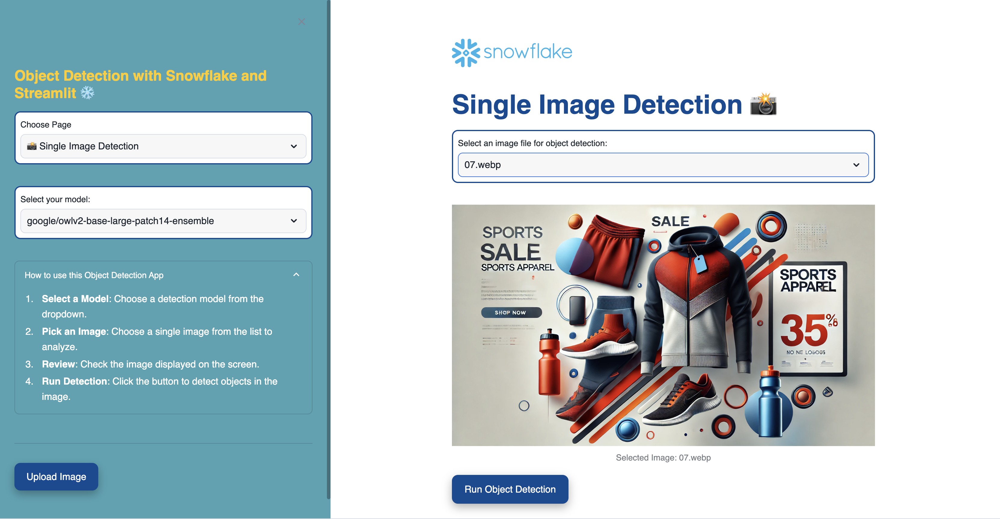
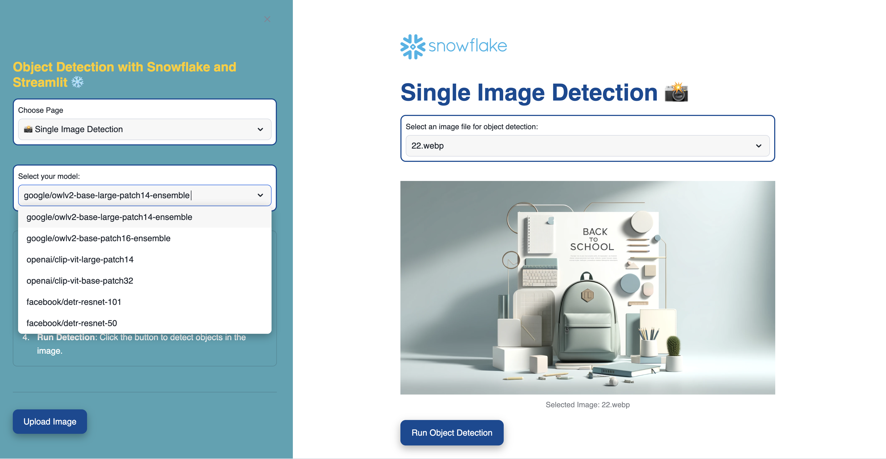
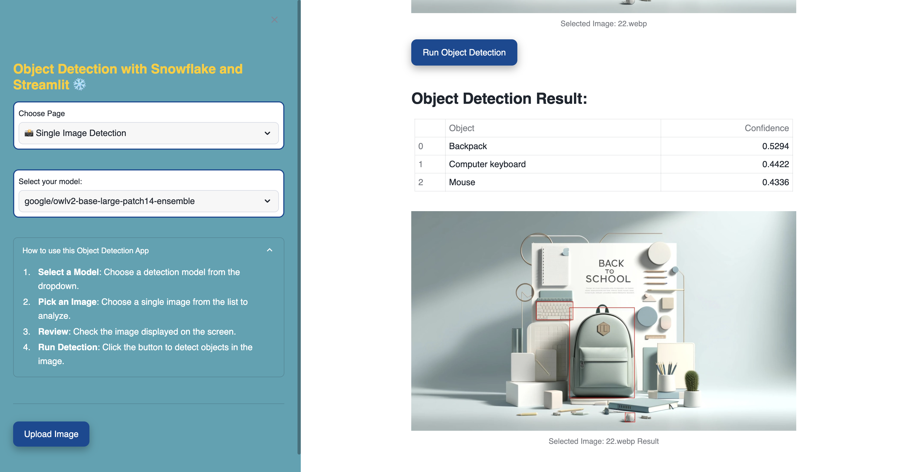
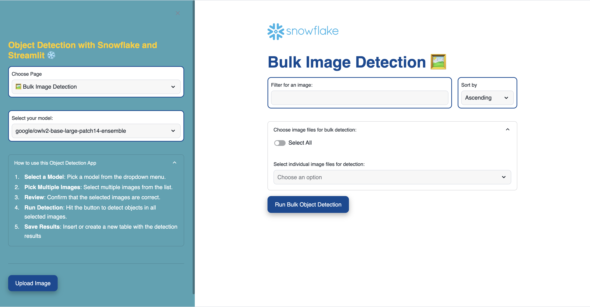
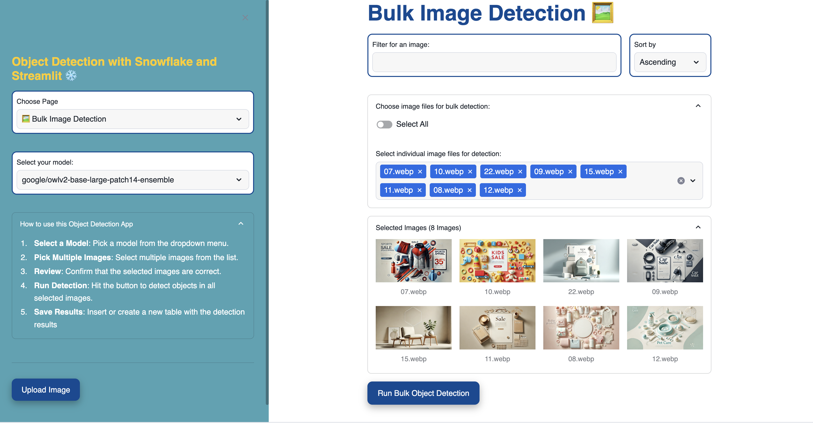
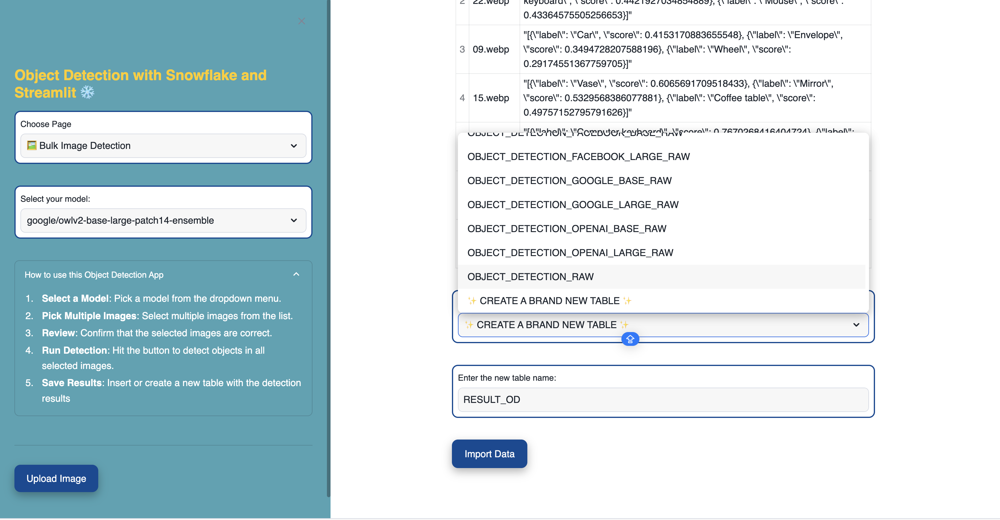

## Overview

Imagine you need to analyze customer behavior based on their interactions with your campaign, but you have 1,000 unlabeled images. On a local CPU, it could take over 2 hours to label them all. But with GPU power in Snowflake, you can get it done in under 2 minutes❗

So, what did I do? I built a Zero-Shot Object Detection app.

This app leverages 𝗦𝘁𝗿𝗲𝗮𝗺𝗹𝗶𝘁'𝘀 built-in features (at no additional cost to create your awesome app) and Python as the backbone of the development. Python’s flexibility and powerful libraries made it incredibly easy to build this solution quickly and efficiently (Alhamdulillah it's using 𝗣𝘆𝘁𝗵𝗼𝗻 😭 ).

## How It Works

Here’s a breakdown of the process:

• #𝟭 𝗣𝗶𝗰𝘁𝘂𝗿𝗲: The first page lets you perform single-image detection. This is where you test different models before moving on to bulk image detection. And you can also upload new images directly into your Snowflake internal stage.

• #𝟮 𝗣𝗶𝗰𝘁𝘂𝗿𝗲: You can bring any model into Snowflake! ❄ I’ve included models from Google, OpenAI, and Facebook. You can also swap out the image for object detection at any time.

• #𝟯 𝗣𝗶𝗰𝘁𝘂𝗿𝗲: Once you're satisfied with the image and the model, simply hit the run button. The result will be the top 3 objects with the highest confidence, complete with bounding boxes to make the results clear and trustworthy.

• #𝟰 𝗣𝗶𝗰𝘁𝘂𝗿𝗲: The second page is for bulk image detection. Here, you can detect multiple images simultaneously, and you have useful features like filtering, sorting, and selecting all images.

• #𝟱 𝗣𝗶𝗰𝘁𝘂𝗿𝗲: To select images for detection, simply click the drop-down menu. From there, you can choose the images you want to detect objects in, and preview them before running the detection.

• #𝟲 𝗣𝗶𝗰𝘁𝘂𝗿𝗲: The final result is a table that lists the image name along with a JSON output containing the labels and their confidence scores. You can store the results in an existing table or create a new one in Snowflake.

By streamlining image labeling, this app can save hours of work and provide confidence in your data-driven decisions. You can also do other exciting object detection projects, for example: 
1. Automating retail product recognition, 
2. Enhancing vehicle damage assessment for insurance, 
3. Improving wildlife monitoring for conservation, 
4. And boosting warehouse efficiency with real-time inventory tracking. 

Ready to accelerate your image detection tasks? Reach out to learn how Snowflake's GPU-enabled solutions can supercharge your business!

## How To Set It Up

_Coming Soon!_
